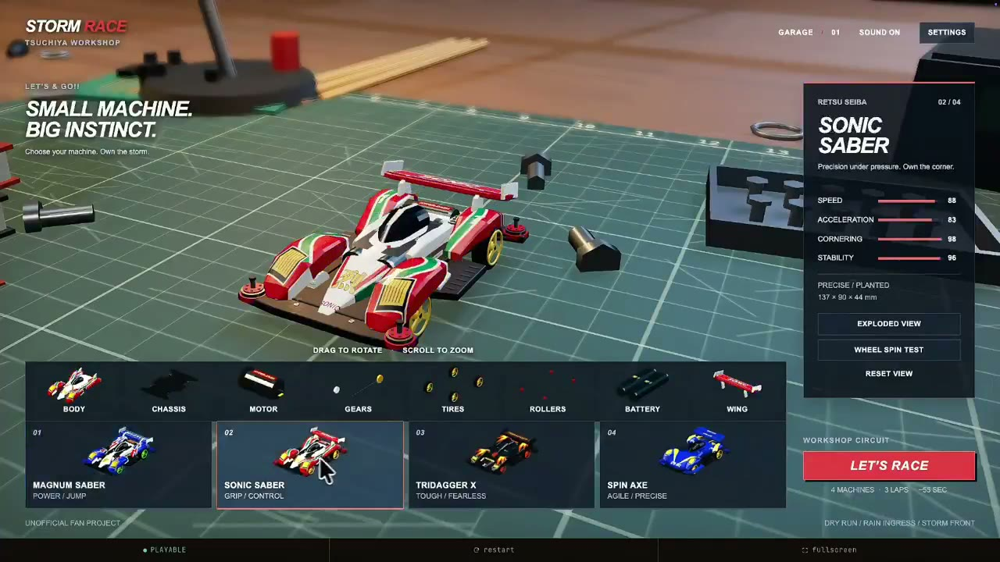
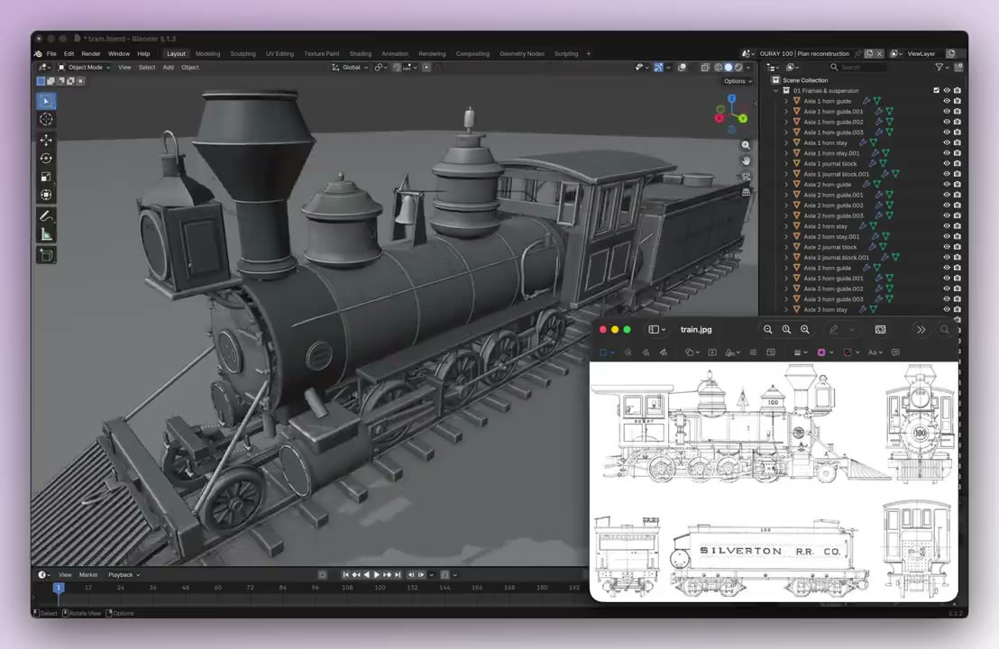
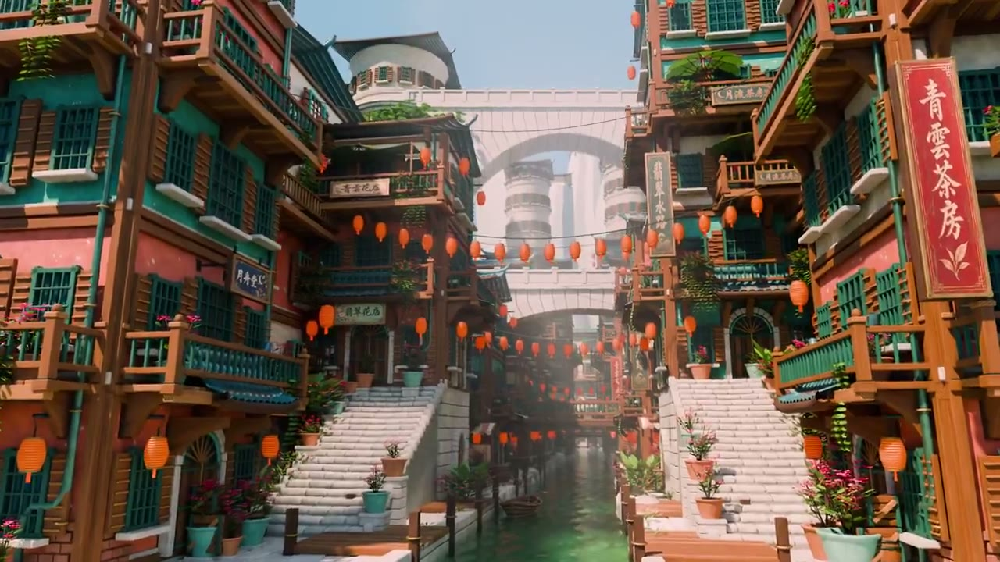
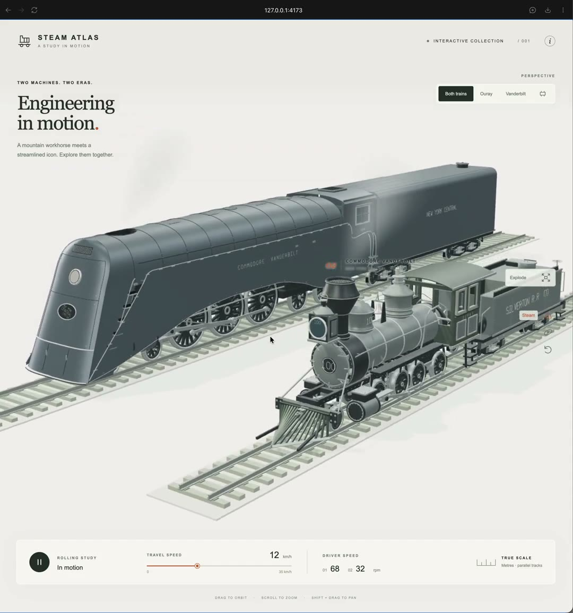
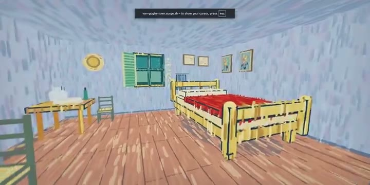
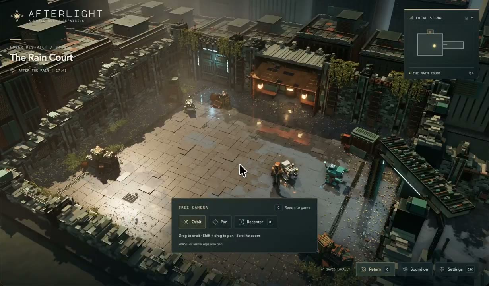
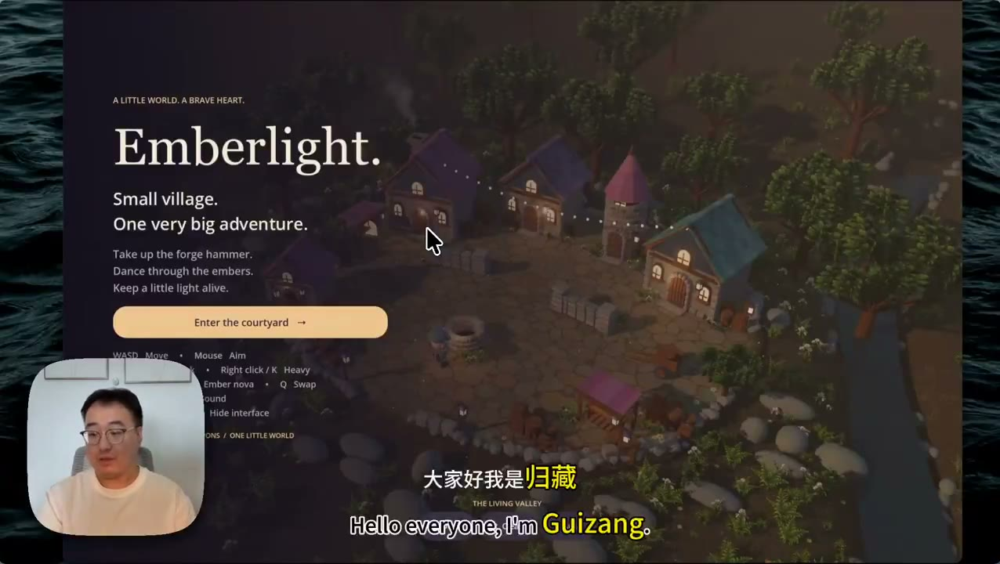
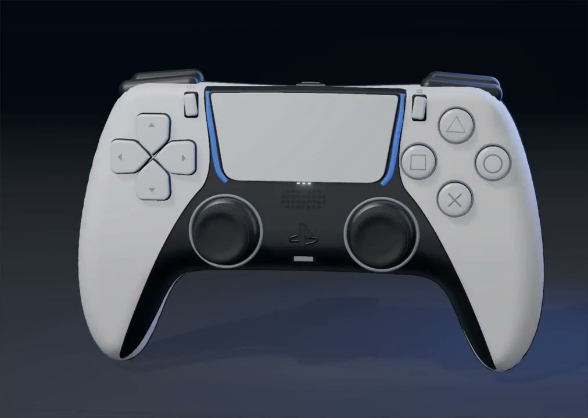
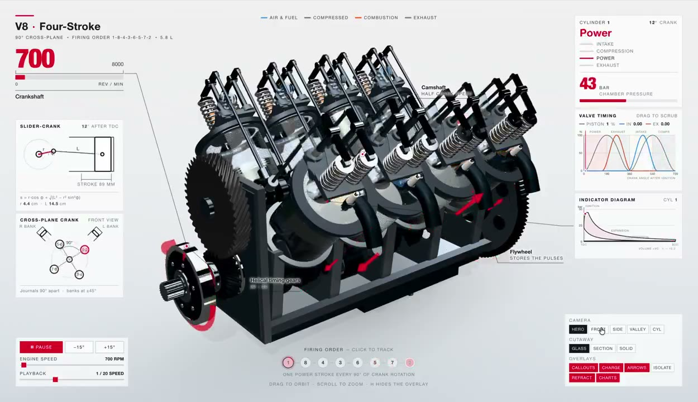

<!-- Generated by scripts/generate.mjs. Edit data/prompts.json or the generator, not this file. -->

  

# Awesome GPT-6 Astra 3D Prompts 中文版

32 条经过人工审核、可追溯来源的 GPT-6 Astra 3D Prompt，覆盖 Blender、Three.js、WebGL、游戏、CAD、产品可视化和 Agent 工作流，并展示真实结果、原始来源和作者署名。

**[浏览全部 32 条 Prompt](#prompt-gallery)** · **[通过 API 使用 GPT-6 Astra](https://beatapi.io/gpt-6-astra-api?utm_source=github&utm_medium=readme&utm_campaign=awesome-3d-prompts)** · **[English](./README.md)** · **[贡献 Prompt](https://github.com/BeatAPI/awesome-3d-prompts/issues/new?template=prompt.yml)**

32 source-backed cases · 6 workflows · 32 visual previews · exact/derived fidelity labels

## 按工作流浏览

[Blender 场景 (10)](#blender-scenes) · [Web 3D (11)](#web-3d) · [游戏引擎 (3)](#game-engines) · [产品可视化 (2)](#product-visualization) · [CAD 与 3D 打印 (3)](#cad-3d-printing) · [Agent 工作流 (3)](#3d-workflow)

## 这个合集有什么不同

这里不只罗列 Prompt。每条案例都会展示实际结果预览、可复制的 Prompt 或 Agent 指令、原始作者与帖子、使用的 3D 引擎、核验日期，以及该指令是原文还是根据公开来源整理。

> GPT-6 Astra 是来源所述工作流使用的模型。BeatAPI 提供模型 API；Blender、Three.js、WebGL、Godot、MCP 服务和渲染工具属于工作流中的独立部分。

## Prompt 案例库

### Blender 场景 (10)

#### 1. [Reconstruct a Detailed Steam Train in Blender](details/blender-steam-train-reconstruction-310311.md)

A vintage train drawing becomes a detailed Blender model made from thousands of editable objects.

<strong>Prompt</strong> — Use Blender to reconstruct the supplied vintage steam-train drawing as a detailed, fully editable 3D model. Keep the geometry clean and organize the build into separate editable o…

~~~~text
Use Blender to reconstruct the supplied vintage steam-train drawing as a detailed, fully editable 3D model. Keep the geometry clean and organize the build into separate editable objects instead of producing one fused mesh.
~~~~

**模型:** GPT-6 Astra · **引擎:** Blender · **Prompt 类型:** 依据来源整理

**来源:** [Tom Krcha](https://x.com/tomkrcha/status/2095756085890310311) · [原始帖子与结果](https://x.com/tomkrcha/status/2095756085890310311) · [完整证据与版权说明](details/blender-steam-train-reconstruction-310311.md)

---

#### 2. [Reconstruct a Reference Street as an Editable Blender Scene](details/blender-street-scene-reconstruction-666003.md)

A richly layered street reference is reconstructed as an editable Blender environment with visible depth and architecture.

<strong>Prompt</strong> — Use the supplied street image as reference and reconstruct the background street scene as an editable Blender environment. Model the architecture, depth, props, and visible spatia…

~~~~text
Use the supplied street image as reference and reconstruct the background street scene as an editable Blender environment. Model the architecture, depth, props, and visible spatial relationships rather than producing a flat image.
~~~~

**模型:** GPT-6 Astra · **引擎:** Blender · **Prompt 类型:** 依据来源整理

**来源:** [Hirokazu Yokohara](https://x.com/Yokohara_h/status/2096622171011666003) · [原始帖子与结果](https://x.com/Yokohara_h/status/2096622171011666003) · [完整证据与版权说明](details/blender-street-scene-reconstruction-666003.md)

---

#### 3. [Create, Rig, and Animate a Production-Ready 3D Character](details/agi-is-100-solved-660277.md)

An end-to-end agent workflow designs a character, builds and retopologizes it in Blender, rigs it, evaluates it, and turns it into an animation.

<strong>Prompt</strong> — Take control of my computer using GPT-6 Astra and do the following: 1. design a character concept using Higgsfield Soul 2.0, 2. build a textured 3D model of it, 3. import it into…

~~~~text
Take control of my computer using GPT-6 Astra and do the following:

1. design a character concept using Higgsfield Soul 2.0,

2. build a textured 3D model of it,

3. import it into Blender,

4. retopologize the mesh,

5. create a UV map,

6. build a character rig,

7. evaluate how production-ready the model is,

8. redo previous steps if you're not satisfied with results,

9. and then turn it into a cartoon using Seedance 2.5 on Higgsfield
~~~~

**模型:** GPT-6 Astra · **引擎:** Blender · **Prompt 类型:** 原文

**来源:** [Higgsfield AI 🧩](https://x.com/higgsfield_ai/status/2096342420543660277) · [原始帖子与结果](https://x.com/higgsfield_ai/status/2096342420543660277) · [完整证据与版权说明](details/agi-is-100-solved-660277.md)

---

#### 4. [Model a Luxury Concrete Residence in Blender](details/gpt-6-astra-437245.md)

A stylish reinforced-concrete residence is modeled and rendered as a polished architectural visualization in Blender.

<strong>Prompt</strong> — blender つかってめちゃくちゃオシャレな戸建てRC住宅でお金持ちが港区に立てそうな住宅のモデリングして

~~~~text
blender つかってめちゃくちゃオシャレな戸建てRC住宅でお金持ちが港区に立てそうな住宅のモデリングして
~~~~

**模型:** GPT-6 Astra · **引擎:** Blender · **Prompt 类型:** 原文

**来源:** [asagi](https://x.com/asagilf/status/2096124859814437245) · [原始帖子与结果](https://x.com/asagilf/status/2096124859814437245) · [完整证据与版权说明](details/gpt-6-astra-437245.md)

---

#### 5. [Reconstruct an Apartment from a Reference Image in Blender](details/gpt-6-astra-is-insane-it-built-my-apartment-using-blender-in-472863.md)

A supplied apartment reference is reconstructed as a complete editable Blender scene.

<strong>Prompt</strong> — given the ref image, model it in 3d using blender

~~~~text
given the ref image, model it in 3d using blender
~~~~

**模型:** GPT-6 Astra · **引擎:** Blender · **Prompt 类型:** 原文

**来源:** [andreicovaciu](https://x.com/imalittledev/status/2096159697363472863) · [原始帖子与结果](https://x.com/imalittledev/status/2096159697363472863) · [完整证据与版权说明](details/gpt-6-astra-is-insane-it-built-my-apartment-using-blender-in-472863.md)

---

#### 6. [Rebuild a House from Reference Video with Blender Python](details/how-i-built-this-house-in-blender-466863.md)

A reference video guides a detailed Blender reconstruction of a house, including architecture, furniture, materials, lighting, and cameras.

<strong>Prompt</strong> — Build an editable Blender scene through Blender Python API (bpy) based on the reference video. Recreate the architecture, joinery, furniture, planting, materials, lights, and came…

~~~~text
Build an editable Blender scene through Blender Python API (bpy) based on the reference video. Recreate the architecture, joinery, furniture, planting, materials, lights, and cameras, and make everything match the reference as closely as possible.
~~~~

**模型:** GPT-6 Astra · **引擎:** Blender · **Prompt 类型:** 原文

**来源:** [AiSongMan｜AI Workflow Lab](https://x.com/aisongman/status/2096876083094466863) · [原始帖子与结果](https://x.com/aisongman/status/2096876083094466863) · [完整证据与版权说明](details/how-i-built-this-house-in-blender-466863.md)

---

#### 7. [Model a Photorealistic Toy Poodle in Blender](details/make-me-a-photorealistic-toy-poodle-in-blender-563865.md)

A photorealistic toy poodle is modeled and rendered as a complete Blender scene.

<strong>Prompt</strong> — make me a photorealistic toy poodle in Blender

~~~~text
make me a photorealistic toy poodle in Blender
~~~~

**模型:** GPT-6 Astra · **引擎:** Blender · **Prompt 类型:** 原文

**来源:** [Ash Anderson](https://x.com/ashjanderson/status/2096304638282563865) · [原始帖子与结果](https://x.com/ashjanderson/status/2096304638282563865) · [完整证据与版权说明](details/make-me-a-photorealistic-toy-poodle-in-blender-563865.md)

---

#### 8. [Build and Rig a Mech from AI-Generated Blueprints](details/use-headless-blender-5-2-1-to-build-a-highly-detailed-3d-392570.md)

Headless Blender turns inconsistent blueprint references into a coherent rigged mech and a short weapons-and-agility animation.

<strong>Prompt</strong> — use headless Blender 5.2.1 to build a highly detailed 3d model of the mech based on this blueprint: `/Users/vatro/codex-blender-headless-astra/mech-blueprint.png`. use additional…

~~~~text
use headless Blender 5.2.1 to build a highly detailed 3d model of the mech based on this blueprint: `/Users/vatro/codex-blender-headless-astra/mech-blueprint.png`. use additional mech reference images which you can find inside the same directory for more detailed reference. keep in mind that the blueprint and all reference images are AI-generated, so details might be inconsistent across images. in case you detect inconsistent details, be creative and find a solution so that the resulting 3D model of the mech still looks consistent and physically correct. the 3d model of the mech should be rigged. demonstrate goal's completion by rendering a 10 seconds animation of the mech presenting it's weapons and battle agility.

only steering:
pick best suited reference images, don't favor the blueprint just because it was explicitly mentioned.
~~~~

**模型:** GPT-6 Astra · **引擎:** Blender · **Prompt 类型:** 原文

**来源:** [Vatroslav Vrbanić](https://x.com/vatro_vrbanic/status/2095975726558392570) · [原始帖子与结果](https://x.com/vatro_vrbanic/status/2095975726558392570) · [完整证据与版权说明](details/use-headless-blender-5-2-1-to-build-a-highly-detailed-3d-392570.md)

---

#### 9. [Create a LEGO-Style Game Character with Blender MCP](details/use-the-blender-mcp-to-make-a-lego-minifig-version-of-donald-847059.md)

Blender MCP produces a detailed LEGO-style character designed for use as a polished game asset.

<strong>Prompt</strong> — Use the Blender MCP to make a LEGO minifig version of Donald Trump that I can use as a game asset. Make this exceptional quality, AAA game, and pressure test your work to make sur…

~~~~text
Use the Blender MCP to make a LEGO minifig version of Donald Trump that I can use as a game asset. Make this exceptional quality, AAA game, and pressure test your work to make sure that it's detailed and accurate and excellent.
~~~~

**模型:** GPT-6 Astra · **引擎:** Blender · **Prompt 类型:** 原文

**来源:** [Simon Smith](https://x.com/_simonsmith/status/2096766465730847059) · [原始帖子与结果](https://x.com/_simonsmith/status/2096766465730847059) · [完整证据与版权说明](details/use-the-blender-mcp-to-make-a-lego-minifig-version-of-donald-847059.md)

---

#### 10. [Reconstruct a Reference Image as a 3D Blender Model](details/using-gpt-6-astra-model-609269.md)

A reference image is interpreted as a detailed editable 3D model inside Blender.

<strong>Prompt</strong> — Make a 3d model of the given image in blender Are 3d artist cooked after this??

~~~~text
Make a 3d model of the given image in blender

Are 3d artist cooked after this??
~~~~

**模型:** GPT-6 Astra · **引擎:** Blender · **Prompt 类型:** 原文

**来源:** [SB nft](https://x.com/SBnft25/status/2096494350943609269) · [原始帖子与结果](https://x.com/SBnft25/status/2096494350943609269) · [完整证据与版权说明](details/using-gpt-6-astra-model-609269.md)

---

### Web 3D (11)

#### 11. [Generate Two Steam Trains Procedurally in Three.js](details/procedural-threejs-trains-777041.md)

Two detailed locomotives are generated at runtime from TypeScript geometry rather than imported model files.

<strong>Prompt</strong> — Create an interactive Three.js experience with two steam locomotives generated entirely at runtime from TypeScript and Three.js geometry code. Do not use imported 3D model files;…

~~~~text
Create an interactive Three.js experience with two steam locomotives generated entirely at runtime from TypeScript and Three.js geometry code. Do not use imported 3D model files; construct the dimensions, profiles, wheels, bodies, details, and motion procedurally.
~~~~

**模型:** GPT-6 Astra · **引擎:** Three.js · **Prompt 类型:** 依据来源整理

**来源:** [Tom Krcha](https://x.com/tomkrcha/status/2096082580554777041) · [原始帖子与结果](https://x.com/tomkrcha/status/2096082580554777041) · [完整证据与版权说明](details/procedural-threejs-trains-777041.md)

---

#### 12. [Turn Six Van Gogh Paintings into a Walkable 3D Town](details/van-gogh-walkable-town-346105.md)

Six Van Gogh paintings are combined into one coherent, browser-based town that visitors can walk through.

<strong>Prompt</strong> — Create a walkable Three.js town that combines the environments and visual language of six Van Gogh paintings into one coherent 3D world. Let the user explore the town interactivel…

~~~~text
Create a walkable Three.js town that combines the environments and visual language of six Van Gogh paintings into one coherent 3D world. Let the user explore the town interactively in the browser.
~~~~

**模型:** GPT-6 Astra · **引擎:** Three.js · **Prompt 类型:** 依据来源整理

**来源:** [Peter Gostev](https://x.com/petergostev/status/2095776685807346105) · [原始帖子与结果](https://x.com/petergostev/status/2095776685807346105) · [完整证据与版权说明](details/van-gogh-walkable-town-346105.md)

---

#### 13. [Recreate a VALORANT-Style FPS in Three.js](details/asked-gpt-6-astra-to-make-valorant-069548.md)

A recognizable tactical first-person shooter experience is recreated as a playable Three.js scene.

<strong>Prompt</strong> — hey gpt-6 astra, make me VALORANT in three.js, make no mistakes. as a map use valorants

~~~~text
hey gpt-6 astra, make me VALORANT in three.js, make no mistakes. as a map use valorants
~~~~

**模型:** GPT-6 Astra · **引擎:** Three.js · **Prompt 类型:** 原文

**来源:** [valohabercisi](https://x.com/valohabercisi/status/2096550643599069548) · [原始帖子与结果](https://x.com/valohabercisi/status/2096550643599069548) · [完整证据与版权说明](details/asked-gpt-6-astra-to-make-valorant-069548.md)

---

#### 14. [Build a Polished Roblox Kart Racer with Blender and Three.js](details/build-a-finished-polished-kart-racer-in-roblox-studio-via-roblox-mcp-331665.md)

A complete Roblox racing circuit combines generated 3D assets, responsive driving, AI opponents, race flow, lighting, effects, audio, and UI.

<strong>Prompt</strong> — Build a finished, polished kart racer in Roblox Studio via Roblox MCP. Create cohesive, detailed assets using Blender and Three.js procedural generation; finalize meshes, UVs, and…

~~~~text
Build a finished, polished kart racer in Roblox Studio via Roblox MCP. Create cohesive, detailed assets using Blender and Three.js procedural generation; finalize meshes, UVs, and baked textures in Blender, then import as optimized Roblox MeshParts with compatible PBR textures. Verify scale, pivots, materials, and collisions in-game. Use Roblox-native rendering and Luau gameplay; Three.js is an asset-generation tool, not the runtime. Prioritize one beautiful, fully dressed circuit with responsive driving/drifting, AI opponents, checkpoints, lap tracking, and a complete countdown-to-results loop with restart. Polish lighting, VFX, audio, and UI. Playtest full races, inspect actual gameplay screenshots, and iterate until broken imports, visual defects, and gameplay bugs are fixed while maintaining smooth performance. No placeholders, crude assets, or prototype visuals. Deliver the fully assembled, playable Roblox experience—not just scripts or exported assets.
~~~~

**模型:** GPT-6 Astra · **引擎:** Blender + Three.js · **Prompt 类型:** 原文

**来源:** [Givros](https://x.com/givros/status/2096219700879331665) · [原始帖子与结果](https://x.com/givros/status/2096219700879331665) · [完整证据与版权说明](details/build-a-finished-polished-kart-racer-in-roblox-studio-via-roblox-mcp-331665.md)

---

#### 15. [Animate a Pelican Riding a Bicycle in an Interactive 3D Scene](details/create-a-stylish-interactive-3d-scene-of-a-pelican-riding-a-bicycle-331489.md)

A cycling pelican becomes a polished browser-based 3D scene with smooth pedaling, adjustable speed, rotation, and zoom controls.

<strong>Prompt</strong> — Create a stylish, interactive 3D scene of a pelican riding a bicycle, and display it in the browser. The pelican should wear a red-and-white cycling cap and sunglasses. Give the b…

~~~~text
Create a stylish, interactive 3D scene of a pelican riding a bicycle, and display it in the browser.
The pelican should wear a red-and-white cycling cap and sunglasses. Give the bicycle a mint-green vintage frame, and add animated speed lines to emphasize motion.
Let me rotate the scene, zoom in, and adjust the cycling speed. Pay close attention to bicycle geometry, character proportions, and natural pedaling motion. Keep the animation smooth as the speed changes.
Make the page polished and ready for a public demo, with thoughtful lighting, a cohesive color palette, and clean controls.
Test it in the browser yourself and fix any visual or interaction bugs before finishing.
~~~~

**模型:** GPT-6 Astra · **引擎:** 原始来源未注明 · **Prompt 类型:** 原文

**来源:** [AI Builder Club](https://x.com/aibuilderclub_/status/2096213850383331489) · [原始帖子与结果](https://x.com/aibuilderclub_/status/2096213850383331489) · [完整证据与版权说明](details/create-a-stylish-interactive-3d-scene-of-a-pelican-riding-a-bicycle-331489.md)

---

#### 16. [Build an Anti-Gravity Combat Racer with Three.js Shaders](details/gpt-6-astra-did-this-in-1-prompt-and-25-minutes-582044.md)

A fast browser racing game combines drifting, boosts, weapons, AI opponents, banking cameras, and neon shader lighting.

<strong>Prompt</strong> — Make me the most insane and blast of a high-speed anti-gravity combat racer you can possibly build on ThreeJS + Web shaders bro! The most important things are blistering sense of…

~~~~text
Make me the most insane and blast of a high-speed anti-gravity combat racer you can possibly build on ThreeJS + Web shaders bro! The most important things are blistering sense of speed, tight drifting, boost mechanics, track elevation drops, motion blur, and jaw-dropping neon shader lighting. It's an intense futuristic raceway high above a strange world where aggressive AI racers battle for first place. Must have smooth camera banking into turns, shield/weapon pickups, and punchy air-brake physics. 3 craft types: a featherlight glass-cannon speeder, an agile balanced interceptor, and a heavy armored ramming tank. This is a Wipeout / Redout style AAA arcade racer in the browser. Do it right bro, I believe in you! An unusual setting for the game, pick it yourself. Please don't read the memory, don't read anything. Start from a blank slate.
~~~~

**模型:** GPT-6 Astra · **引擎:** Blender + Three.js · **Prompt 类型:** 原文

**来源:** [Alexey Fateev](https://x.com/superalesha/status/2095967568825582044) · [原始帖子与结果](https://x.com/superalesha/status/2095967568825582044) · [完整证据与版权说明](details/gpt-6-astra-did-this-in-1-prompt-and-25-minutes-582044.md)

---

#### 17. [Build a Complete Low-Poly Crab Adventure Game](details/gpt-6-astra-one-shotted-this-game-in-43-minutes-591171.md)

A low-poly tropical island becomes a complete playable crab adventure with exploration, collectibles, progression, interactions, and a tightly constrained art direction.

<strong>Prompt</strong> — SAVE IT AS A FILE IN THE PROJECT FOLDER, NOT AS A CHAT MESSAGE. THEN: /goal build this in three.js, read SPEC.md and follow it exactly, especially section 9. { START } 1 THE LOOK…

~~~~text
SAVE IT AS A FILE IN THE PROJECT FOLDER, NOT AS A CHAT MESSAGE.
THEN: /goal build this in three.js, read SPEC.md and follow it
exactly, especially section 9.

{ START }

1 THE LOOK

bright low poly, the way a modern mobile adventure looks. flat
single colour surfaces, no textures, no photorealism. every shape
chunky and rounded, built from big simple volumes. soft round
shadows, not sharp ones. every colour saturated and warm, nothing
washed out.

sand: warm cream, almost yellow
shallow water: bright turquoise. deep water: strong teal
palm leaves: fresh green. trunks: light brown
rock: warm sandstone, dusty ochre, never cold or blue
the crab: deep coral red, darker at every joint
its shell: pale bone white, the only near white in the scene

clear gradient blue sky, three or four soft rounded clouds. sun
high and slightly behind the camera.
if a surface looks detailed, simplify it.

2 THE CHARACTER

the player is a crab. both claws are the same build and the same
size, and each has to read as a pincer at a glance.

a crab claw is flattened side to side: narrow across, tall, long
along its own axis. built as a cube it reads as a box on a stick.

build each claw from four parts, sized against the body width:

1 upper arm. a rounded cylinder from the side of the body.
  length 0.30, thickness 0.27.
2 palm. a rounded box, flattened across: width 0.34, height
  0.64, depth 0.54. depth is the long axis, running out along
  the claw.
3 fixed finger. grows out of the top front of the palm, length
  0.80 of the palm depth. fat at the base, tapering, and hooked
  hard downward over its last third.
4 moving finger. the same shape mirrored below, hinged at the
  palm, hooking up. the two are carried about sixty degrees
  apart, so the pair reads as an open crescent.

swing the claw 54 degrees out from the walking direction. not
forward, because the camera rides behind and a forward claw is
seen end on with the palm hiding the fingers. not ninety, which
reads as a fork stuck out sideways.

forbidden for the claw: no flat blades, no thin plates, no
spikes, no arrow or dart shapes, no fins, no cube shaped palm,
no fingers shorter than half the palm, no straight fingers.

it carries a shell that is not its own. on the rear half of its
back sits a smooth dome of pale bone white stone, flat on top,
with seven shallow round sockets cut into it in a ring. the dome
sits behind the eyes and never over them: a shell on the back,
not a helmet and not a face.

the sockets are empty at the start. every crystal shard the crab
picks up drops into the next socket and stays lit. by the end
the shell is a ring of seven lights and the crab is visibly a
different character than it started as.

the body is a rounded wedge, wider than tall. six short legs.
two eyes on short stalks on the body, never on the shell.

it faces the direction it is travelling and the camera sits
behind it. six legs scuttle. turning sharply, it plants a claw
and pivots around it.

standing still, it taps a claw tip against the sand, twice, then
waits. that tap is the character.

3 THE WORLD

a small tropical island seen from a low three quarter view. the
playable area is a curved beach wrapping the island, water on one
side and land on the other.

a wide sand strip with a wet darker band at the waterline. palm
trees, every one leaning differently, never two the same height.
warm sandstone boulders, some standing in the shallows. driftwood
logs. a short wooden jetty. a cave mouth in a sandstone face at
one end. low green bushes in clumps along the back of the beach,
chunky rounded leaves, flat colour, no individual blades. seven
wooden chests scattered along the beach, closed. starfish and
shells as small props.

small waves push in and out in a slow loop. palm leaves sway.
nothing else moves on its own.

4 THE ACTIONS, DESCRIBED ONLY THROUGH USES

the crab scuttles across the sand and old dull gold coins lift
off the ground, arc toward it and vanish into it as it passes. it
never has to touch them exactly.

the crab enters the shallow water and its legs kick up small
white splashes.

the crab reaches a driftwood log, hops it, lands with a puff of
sand.

the crab enters the cave mouth and the inside lights up around
it.

the crab taps a wooden chest twice with a claw, the lid throws
open and what is inside rises out.

the crab touches a crystal shard. the shard rises, spins once,
and drops into the next empty socket on its shell, where it stays
lit for the rest of the game.

show all of this happening. never explain it in a caption.

5 THE GOAL

seven crystal shards are hidden around the island. collecting all
seven fills the shell and finishes the game.

placed in rising difficulty:
1 in plain sight on open sand, so the player learns the shape
2 behind a clump of palms, seen only when walking past
3 at the end of the wooden jetty
4 in the shallows, half covered by a boulder
5 inside the cave mouth
6 on top of a rock the crab has to hop up to reach
7 inside the seventh chest

no two shards are the same colour. in order: amber, rose, violet,
deep blue, sea green, pale ice, and the last one burning orange.
the shell lights up in those colours as they land.

six of the seven chests hold a pile of coins, the seventh holds
the last shard. an opened chest stays open.

coins are everywhere and never required. they exist to make the
space between shards worth crossing.

6 THE INTERFACE

a HUD is allowed. nothing else is.

top left: a coin icon and a number, a shard icon and a count out
of seven. top right: one short line naming the objective.

no health bar, no timer, no minimap, no joystick graphic, no
tutorial popup, no floating labels in the world, no speech, no
captions explaining what just happened.

when the seventh shard lands, the objective line is replaced by a
single line saying the island is clear.

7 THE CAMERA

behind the crab and slightly above, roughly four crab lengths
back, angled down about thirty degrees. it never leaves the crab.
no cutscenes, no fly overs, no establishing shots, no orbits.
passing close to a palm trunk, it eases in, then back out.

8 NOTHING REPEATS

no two palms share a height, a lean, or a leaf count. no two
boulders share a silhouette. the seven shards differ in colour
and in the shape of the cut. the beach is never symmetrical: the
jetty sits at one third of its length, the cave at the far end,
never centred. the crab is the only red object in the world. the
shell is the only near white surface.

9 BANNED, EACH ONE NAMED

gameplay: no enemies, no combat, no health, no damage, no dying,
no timer, no score multiplier, no lives, no shop, no upgrades, no
dialogue, no cutscene, no loading screen art.

character: no spiral snail shell, no googly eyes, no hat, no
clothing, no backpack, no face on the shell, no cartoon eyebrows,
no sunglasses.

scene: no beach umbrella, no deck chair, no pirate flag, no
message in a bottle, no seagulls, no crabs other than the player,
no fish, no beach ball, no sandcastle, no footprints trail, no
floating bubbles.

repeats of my earlier build: no grass field, no mushrooms, no
wooden crates, no red round trees, no rolling green hills.

render: no realistic textures, no snow, no desert, no night, no
sunset, no rain, no fog, no lens flare, no film grain, no
letterboxing, no depth of field blur.

{ END }

that fourth group is the one nobody writes. those five are from a
game I shipped in august. without them the model rebuilds it.
~~~~

**模型:** GPT-6 Astra · **引擎:** Three.js · **Prompt 类型:** 原文

**来源:** [ZEUS⚡️](https://x.com/zeuuss_01/status/2096337879173591171) · [原始帖子与结果](https://x.com/zeuuss_01/status/2096337879173591171) · [完整证据与版权说明](details/gpt-6-astra-one-shotted-this-game-in-43-minutes-591171.md)

---

#### 18. [Build a Playable Browser-Based 3D Flight Simulator](details/gpt-6-astra-struggles-with-a-flight-simulator-512181.md)

A browser flight simulator includes an airport, controllable aircraft, basic flight physics, HUD, objectives, takeoff, landing, and failure states.

<strong>Prompt</strong> — Build a polished, playable browser-based 3D flight simulator game from scratch. The goal is to create a small but genuinely playable flight-sim experience, not a static 3D scene.…

~~~~text
Build a polished, playable browser-based 3D flight simulator game from scratch.

The goal is to create a small but genuinely playable flight-sim experience, not a static 3D scene.

GAMEPLAY
- Create an airport with a detailed runway, taxiway, terminal/buildings, grass/terrain, runway markings/lights, sky and clouds.
- Place a recognizable passenger airplane at the airport.
- The player must be able to control the aircraft with the keyboard.
- Implement throttle, pitch, roll, yaw and braking.
- The aircraft must have basic believable flight physics, momentum and acceleration.
- The player should be able to accelerate down the runway, take off, fly around the airport, approach the runway and land.
- Add a simple objective: take off, complete a short flight around the airport and land safely.
- Include crash/failure detection and a restart option.

CONTROLS
Display controls clearly:
- W/S: Pitch
- A/D: Roll
- Q/E: Yaw
- Shift/Ctrl: Throttle
- Space: Brake

CAMERA
- Use a smooth third-person chase camera behind the aircraft.
- Keep the aircraft clearly visible during flight.
- Camera should smoothly follow movement and respond subtly to acceleration.

HUD
Create a polished aviation-style HUD showing:
- Airspeed
- Altitude
- Heading
- Throttle
- Vertical speed
- Flight status
- Current objective

Include a compact controls/help panel that can be hidden.

START + RESULTS
Create a start screen with:
~~~~

**模型:** GPT-6 Astra · **引擎:** 原始来源未注明 · **Prompt 类型:** 原文

**来源:** [aditya](https://x.com/adxtyahq/status/2096236137266512181) · [原始帖子与结果](https://x.com/adxtyahq/status/2096236137266512181) · [完整证据与版权说明](details/gpt-6-astra-struggles-with-a-flight-simulator-512181.md)

---

#### 19. [Build a God of War-Style Browser Hack-and-Slash Game](details/i-asked-gpt-6-astra-for-god-of-war-in-a-browser-335792.md)

A Three.js arena game combines third-person sword combat, dodging, weighted attacks, enemy hordes, magic, shaders, and responsive camera work.

<strong>Prompt</strong> — Make me the most insane and blast of a third-person hack-and-slash action game you can possibly build on ThreeJS + Web shaders bro! The most important things are combat dynamics,…

~~~~text
Make me the most insane and blast of a third-person hack-and-slash action game you can possibly build on ThreeJS + Web shaders bro! The most important things are combat dynamics, swordplay, brutal hit impact, juicy blood and gore, magic effects, and insane graphics. It's a beautifully designed arena where enemies swarm in hordes. Must have a responsive third-person camera, dodging, and real weapon inertia/weight behind every swing. 3 attack types: fast light sword combos, a crushing heavy two-handed blade, and flashy area-of-effect magic spells. This is a Devil May Cry / God of War style AAA slasher in the browser. Do it right bro, I believe in you! An unusual setting for the game, pick it yourself.
Please don't read the memory, don't read anything. Start from a blank slate.
~~~~

**模型:** GPT-6 Astra · **引擎:** Three.js · **Prompt 类型:** 原文

**来源:** [Alexey Fateev](https://x.com/superalesha/status/2095988972879335792) · [原始帖子与结果](https://x.com/superalesha/status/2095988972879335792) · [完整证据与版权说明](details/i-asked-gpt-6-astra-for-god-of-war-in-a-browser-335792.md)

---

#### 20. [Build a Fish Growth Simulator from Aquarium to Ocean](details/i-asked-gpt-6-astra-to-build-a-game-where-i-m-664627.md)

A fish-growth game progresses from a home aquarium to larger environments and the ocean through feeding, hazards, upgrades, and level design.

<strong>Prompt</strong> — I want to create a fish simulator game.. where we are a fish (which you should be able to select).. we start inside a house aquarium where food particles are falling down or spawn…

~~~~text
I want to create a fish simulator game.. where we are a fish (which you should be able to select).. we start inside a house aquarium where food particles are falling down or spawns or whatever.. we can swim to them and eat the food to grow bigger.. and there might also be obstacles and stuff that damage us to make us smaller. then as we level up we jump into a bigger area progressively until we reach the ocean and stuff. The food we eat can kee cahnging, we can eat other fish and other creatures and all that.
First define the full gameply loop and level designs and stuff for this game into a md file and then implement into a game I can play locally on my browser. select the tech stack that is required
~~~~

**模型:** GPT-6 Astra · **引擎:** 原始来源未注明 · **Prompt 类型:** 原文

**来源:** [Ayush Vachaspati](https://x.com/AVachaspat92841/status/2096156244180664627) · [原始帖子与结果](https://x.com/AVachaspat92841/status/2096156244180664627) · [完整证据与版权说明](details/i-asked-gpt-6-astra-to-build-a-game-where-i-m-664627.md)

---

#### 21. [Build an Interactive 3D Dumpling Club Experience](details/i-made-an-interactive-dumpling-feast-967809.md)

A cozy Three.js food experience turns expressive dumplings, chopsticks, sauce, sound, animation, controls, and local recording into an interactive tasting scene.

<strong>Prompt</strong> — Build a complete, polished interactive 3D website called “The Dumpling Club” using Three.js and the provided dumpling GLB model. Art direction: Create a cozy miniature food scene…

~~~~text
Build a complete, polished interactive 3D website called “The Dumpling Club” using Three.js and the provided dumpling GLB model.

Art direction:
Create a cozy miniature food scene with a warm cream background, terracotta accents, soft studio lighting, realistic shadows, and elegant typography. Pair an expressive serif headline with clean sans-serif controls. Use the headline “Small bites. Big feelings.” Give the scene plenty of breathing room.

The serving:
Place five adorable dumplings inside a round bamboo steamer with layered wooden walls, subtle grain, woven details, and parchment liners. Make the bamboo steamer the default, with a porcelain plate alternative. Add a small bowl of soy sauce beside it.

The personalities:
Give each dumpling a distinct face, blinking eyes, rosy cheeks, and playful expressions. Add delicate rising steam and occasional squash-and-stretch animations. Keep jumps extremely low, almost touching the serving surface. The dumplings should feel soft and alive.

The interaction:
Click a dumpling to make chopsticks gently pick it up, dip it into soy sauce, and bring it toward the camera for a bite. Add sauce ripples, droplets, a glossy dipped edge, tiny crumbs, and a brief English reaction. Let the remaining dumplings watch and react. Make the timing charming and satisfying.

Controls:
Include portions of 3, 5, or 8, refill, autoplay, sound, steam and sauce toggles, a “Boing!” button, and a mode that hides the interface. Add gentle synthesized sound effects.

Video:
Include a “Record a bite” button that creates a short automatic tasting with a live square preview. Export locally at 1080 × 1080 and 30 fps, preferring MP4 with WebM fallback.

Use English throughout. Support mobile, keyboard interaction, and reduced motion. Keep assets local and deliver a fully working experience with polished animation and composition.
~~~~

**模型:** GPT-6 Astra · **引擎:** Three.js · **Prompt 类型:** 原文

**来源:** [Gürsel Günacar](https://x.com/mech_eng_dev/status/2096019217698967809) · [原始帖子与结果](https://x.com/mech_eng_dev/status/2096019217698967809) · [完整证据与版权说明](details/i-made-an-interactive-dumpling-feast-967809.md)

---

### 游戏引擎 (3)

#### 22. [Build a Playable Mini 4WD Racing Game](details/storm-race-threejs-638553.md)

A polished Three.js racing game combines a miniature-car workshop, configuration interface, and playable race.

<strong>Prompt</strong> — Build a playable browser-based Mini 4WD racing game inspired by Bakusou Kyoudai Let's &amp; Go!! using Three.js. Include a polished car workshop and configuration screen, selectable p…

~~~~text
Build a playable browser-based Mini 4WD racing game inspired by Bakusou Kyoudai Let's & Go!! using Three.js. Include a polished car workshop and configuration screen, selectable parts, and a functioning race experience.
~~~~

**模型:** GPT-6 Astra · **引擎:** Three.js · **Prompt 类型:** 依据来源整理

**来源:** [BubuAi](https://x.com/BubuStd/status/2096587056755638553) · [原始帖子与结果](https://x.com/BubuStd/status/2096587056755638553) · [完整证据与版权说明](details/storm-race-threejs-638553.md)

---

#### 23. [Create a Cinematic 3D Game World with Image-Guided Art Direction](details/afterlight-3d-game-725132.md)

A cinematic, playable 3D world uses generated imagery to guide its environment, lighting, and visual identity.

<strong>Prompt</strong> — Build a polished 3D game world in one pass. Use image generation to establish the art direction, then implement the environment, lighting, characters, interface, and playable inte…

~~~~text
Build a polished 3D game world in one pass. Use image generation to establish the art direction, then implement the environment, lighting, characters, interface, and playable interactions as one cohesive browser game.
~~~~

**模型:** GPT-6 Astra · **引擎:** WebGL · **Prompt 类型:** 依据来源整理

**来源:** [Anshu](https://x.com/anshuc/status/2096008083826725132) · [原始帖子与结果](https://x.com/anshuc/status/2096008083826725132) · [完整证据与版权说明](details/afterlight-3d-game-725132.md)

---

#### 24. [Build a Complete 3D Roguelike Level with Blender and Godot](details/blender-godot-roguelike-386950.md)

A complete 3D roguelike level includes an explorable village, dynamic weather, combat systems, and modeled assets.

<strong>Prompt</strong> — Use Blender and Godot Engine to create a complete 3D roguelike level. Include a village environment, a day-and-night cycle, weather, 3D models, textures, weapon switching, skills,…

~~~~text
Use Blender and Godot Engine to create a complete 3D roguelike level. Include a village environment, a day-and-night cycle, weather, 3D models, textures, weapon switching, skills, and both melee and ranged enemies.
~~~~

**模型:** GPT-6 Astra · **引擎:** Blender + Godot · **Prompt 类型:** 依据来源整理

**来源:** [歸藏(guizang.ai)](https://x.com/op7418/status/2096494840431386950) · [原始帖子与结果](https://x.com/op7418/status/2096494840431386950) · [完整证据与版权说明](details/blender-godot-roguelike-386950.md)

---

### 产品可视化 (2)

#### 25. [Model a PS5-Style Controller in Three.js](details/ps5-controller-threejs-649552.md)

A recognizable game controller is modeled as clean Three.js geometry and presented in an interactive product view.

<strong>Prompt</strong> — Create a recognizable 3D PS5-style controller entirely in Three.js. Build the shell, analog sticks, directional pad, face buttons, triggers, and materials as code-generated geomet…

~~~~text
Create a recognizable 3D PS5-style controller entirely in Three.js. Build the shell, analog sticks, directional pad, face buttons, triggers, and materials as code-generated geometry, then present it in a clean interactive viewer.
~~~~

**模型:** GPT-6 Astra · **引擎:** Three.js · **Prompt 类型:** 依据来源整理

**来源:** [bluedev](https://x.com/blueemi99/status/2095967131573649552) · [原始帖子与结果](https://x.com/blueemi99/status/2095967131573649552) · [完整证据与版权说明](details/ps5-controller-threejs-649552.md)

---

#### 26. [Build an Interactive Exploded Smartphone Visualization](details/since-everyone-s-making-insane-stuff-with-gpt-6-astra-694556.md)

A modern smartphone becomes an interactive exploded view with isolated components, explanations, and reassembly controls.

<strong>Prompt</strong> — Build an interactive 3D exploded-view visualization of a modern smartphone. Separate the device into its major components and let me explode/reassemble it with a slider. Clicking…

~~~~text
Build an interactive 3D exploded-view visualization of a modern smartphone. Separate the device into its major components and let me explode/reassemble it with a slider. Clicking a component should isolate it and explain what it does. Include the battery, cameras, SoC, memory, display layers, speakers, sensors, antennas and logic board. Prioritize a beautiful Apple-like interface and satisfying interactions. Build, run, inspect and fix the complete experience.
~~~~

**模型:** GPT-6 Astra · **引擎:** 原始来源未注明 · **Prompt 类型:** 原文

**来源:** [Zaira Laraib](https://x.com/zairalaraib_/status/2096685163111694556) · [原始帖子与结果](https://x.com/zairalaraib_/status/2096685163111694556) · [完整证据与版权说明](details/since-everyone-s-making-insane-stuff-with-gpt-6-astra-694556.md)

---

### CAD 与 3D 打印 (3)

#### 27. [Recreate the Cessna 337 Landing-Gear Mechanism in 3D](details/cessna-337-landing-gear-752922.md)

A reference video is interpreted as an interactive mechanical visualization of the Cessna 337 landing-gear system.

<strong>Prompt</strong> — Watch the supplied YouTube video of a Cessna 337 Skymaster landing-gear mechanism, infer how the mechanism works, and recreate it as an interactive 3D visualization showing the ge…

~~~~text
Watch the supplied YouTube video of a Cessna 337 Skymaster landing-gear mechanism, infer how the mechanism works, and recreate it as an interactive 3D visualization showing the gear motion and mechanical relationships.
~~~~

**模型:** GPT-6 Astra · **引擎:** WebGL · **Prompt 类型:** 依据来源整理

**来源:** [Dilum Sanjaya](https://x.com/DilumSanjaya/status/2096642895134752922) · [原始帖子与结果](https://x.com/DilumSanjaya/status/2096642895134752922) · [完整证据与版权说明](details/cessna-337-landing-gear-752922.md)

---

#### 28. [Create a Detailed Interactive V8 Engine Visualization](details/interactive-v8-engine-775423.md)

A working V8 engine becomes a polished interactive cutaway with moving parts and engineering information.

<strong>Prompt</strong> — Create a highly detailed, interactive visualization of a V8 engine.

~~~~text
Create a highly detailed, interactive visualization of a V8 engine.
~~~~

**模型:** GPT-6 Astra · **引擎:** WebGL · **Prompt 类型:** 原文

**来源:** [Dilum Sanjaya](https://x.com/DilumSanjaya/status/2096280244663775423) · [原始帖子与结果](https://x.com/DilumSanjaya/status/2096280244663775423) · [完整证据与版权说明](details/interactive-v8-engine-775423.md)

---

#### 29. [Prototype a Full Microduck Robot Assembly](details/everyone-is-using-gpt-6-astra-to-make-games-i-had-it-354155.md)

A compact biped robot is expanded into an inspectable parametric assembly with structured parts and hardware.

<strong>Prompt</strong> — prototype me a full Microduck

~~~~text
prototype me a full Microduck
~~~~

**模型:** GPT-6 Astra · **引擎:** 原始来源未注明 · **Prompt 类型:** 原文

**来源:** [Ronin](https://x.com/DeRonin_/status/2096567918859354155) · [原始帖子与结果](https://x.com/DeRonin_/status/2096567918859354155) · [完整证据与版权说明](details/everyone-is-using-gpt-6-astra-to-make-games-i-had-it-354155.md)

---

### Agent 工作流 (3)

#### 30. [Build a Floating Chinese Temple Pixel World](details/create-an-interactive-pixel-block-world-to-show-me-how-good-of-556561.md)

An interactive voxel island combines a Chinese temple, cherry blossoms, waterfalls, mountains, and a day-night switch.

<strong>Prompt</strong> — create an interactive pixel block world to show me how good of a model you are. I want a chinese temple surrounded by pink cherry blossom trees. The entire land should be isolated…

~~~~text
create an interactive pixel block world to show me how good of a model you are. I want a chinese temple surrounded by pink cherry blossom trees. The entire land should be isolated on its own floating island with waterfalls and mountain landscape surrounding the temple. Do not ask for any input from me, I want you to build this all on your own and make the decisions yourself. Make it so I can change between day and night with a simple switch
~~~~

**模型:** GPT-6 Astra · **引擎:** 原始来源未注明 · **Prompt 类型:** 原文

**来源:** [Pn](https://x.com/PhilipNora7/status/2095978925029556561) · [原始帖子与结果](https://x.com/PhilipNora7/status/2095978925029556561) · [完整证据与版权说明](details/create-an-interactive-pixel-block-world-to-show-me-how-good-of-556561.md)

---

#### 31. [Build a Playable 3D Reconstruction of Persepolis](details/i-gave-gpt-6-astra-one-prompt-build-a-playable-3d-persepolis-534111.md)

The ancient city of Persepolis becomes a navigable 3D environment built from one concise instruction.

<strong>Prompt</strong> — build a playable 3D Persepolis.

~~~~text
build a playable 3D Persepolis.
~~~~

**模型:** GPT-6 Astra · **引擎:** 原始来源未注明 · **Prompt 类型:** 原文

**来源:** [Hossein H.](https://x.com/made_by_hossein/status/2096454262817534111) · [原始帖子与结果](https://x.com/made_by_hossein/status/2096454262817534111) · [完整证据与版权说明](details/i-gave-gpt-6-astra-one-prompt-build-a-playable-3d-persepolis-534111.md)

---

#### 32. [Build an Interactive V8 Engine Simulation](details/the-road-to-agi-is-starting-to-look-less-like-chat-and-225522.md)

A V8 engine is presented as an interactive 3D mechanical simulation with visible internal structure.

<strong>Prompt</strong> — Build an interactive V8 engine simulation.

~~~~text
Build an interactive V8 engine simulation.
~~~~

**模型:** GPT-6 Astra · **引擎:** 原始来源未注明 · **Prompt 类型:** 原文

**来源:** [Mosef](https://x.com/HiMosef/status/2096491411470225522) · [原始帖子与结果](https://x.com/HiMosef/status/2096491411470225522) · [完整证据与版权说明](details/the-road-to-agi-is-starting-to-look-less-like-chat-and-225522.md)

---

## 核验方法

当前版本收录 32 条通过审核的案例。每条都需要公开来源、明确的 GPT-6 Astra 模型声明、可复制指令和可见结果。我们宁可保留较小但可追溯的合集，也不会为了数量虚构 Prompt。模型归因来自原作者公开说明，不代表所有案例都经过独立复现。

## 更多 BeatAPI Prompt 合集

- [Awesome MiniMax H3 Prompts](https://github.com/BeatAPI/awesome-minimax-h3-prompts)
- [Awesome Seedance 2.5 Prompts](https://github.com/BeatAPI/awesome-seedance-2-5-prompts)
- [GPT-6 Astra API](https://beatapi.io/gpt-6-astra-api)

## 贡献与版权

新增条目必须提供公开来源、可复制 Prompt 或 Agent 指令、明确的模型声明与可见结果。请阅读 [CONTRIBUTING.md](CONTRIBUTING.md)。

MIT 许可证只覆盖本仓库原创工具与编辑结构。来源 Prompt 和媒体保留各自原始权利，详见 [RIGHTS.md](RIGHTS.md)。
