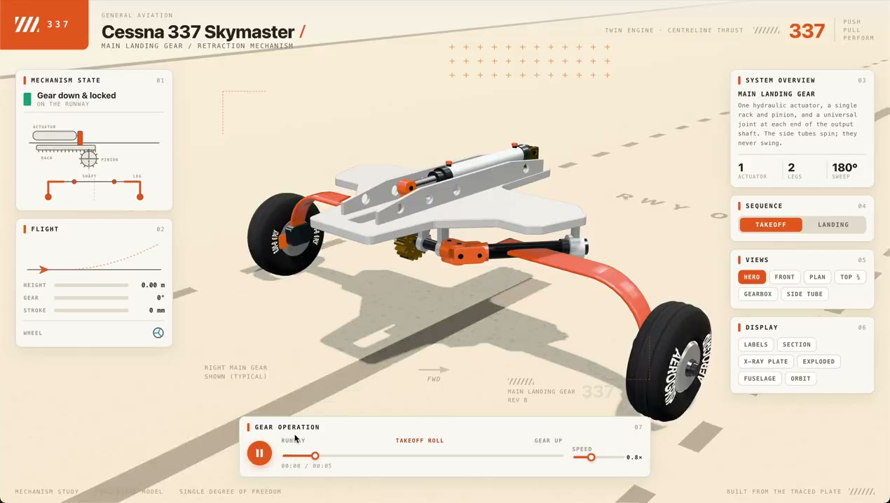

<!-- Generated by scripts/generate.mjs. -->

# Recreate the Cessna 337 Landing-Gear Mechanism in 3D

A reference video is interpreted as an interactive mechanical visualization of the Cessna 337 landing-gear system.

- **Model:** GPT-6 Astra
- **Engine:** WebGL
- **Category:** CAD & 3D Printing
- **Prompt fidelity:** Derived from the public source
- **Source checked:** 2026-09-08
- **Creator:** [Dilum Sanjaya](https://x.com/DilumSanjaya/status/2096642895134752922)
- **Rights:** review-required; preview and prompt retain source attribution

## Prompt

~~~~text
Watch the supplied YouTube video of a Cessna 337 Skymaster landing-gear mechanism, infer how the mechanism works, and recreate it as an interactive 3D visualization showing the gear motion and mechanical relationships.
~~~~

## Original result and attribution

[View the original post and result on X](https://x.com/DilumSanjaya/status/2096642895134752922)

## Run it with GPT-6 Astra

[Open GPT-6 Astra API](https://beatapi.io/gpt-6-astra-api?utm_source=github&utm_medium=detail&utm_campaign=awesome-3d-prompts)

> BeatAPI provides model API access. The 3D application, MCP integration, assets, and rendering pipeline remain separate parts of the workflow.

[← Back to the full prompt gallery](../README.md#prompt-gallery)
